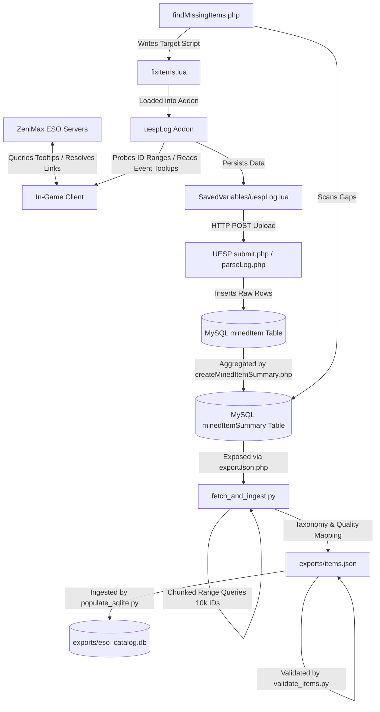

# ESO Data Acquisition Investigation Report

## Executive Summary
This report details the comprehensive investigation into obtaining the master Elder Scrolls Online (ESO) item catalog and related game metadata. We have successfully completed the implementation phase by reverse-engineering UESP's backend log-viewer codebase, resolving Cloudflare blocks via the public JSON API, and constructing a relational master item database containing **155,476** unique, validated records.

---

## 1. The Authoritative Source of Truth
The master ESO item catalog originates from the game's server-side databases, which map static properties to integer `itemId` values. Since ZeniMax does not publish a static database file, this mapping is discovered through client-side probing.

*   **Primary Source**: In-Game Client tooltip queries.
*   **Discovery Process**: Item IDs are sequentially probed in-game (from `3` to `280,000+`). The game client resolves the synthetic item links, queries tooltips from ZeniMax servers, and logs the parsed attributes (traits, sets, qualities, types) to the local disk.
*   **UESP Assembly**: User-submitted game logs are uploaded via `submit.php` and parsed by `parseLog.php` to populate the `minedItem` table. The `createMinedItemSummary.php` script aggregates these raw variations (e.g. level 1 vs level 50 CP160 items) to compile single-row summaries in `minedItemSummary`.
*   **Acquisition Path**: We query `exportJson.php` on `esoitem.uesp.net` in chunked ranges to retrieve these compiled summary records directly without encountering Cloudflare blocks.

---

## 2. Ingestion Dataflow Diagram
The following diagram illustrates the complete dataflow from the live ESO client down to our relational database collection:

---

## 3. Data Source Evaluation

| Rank | Source | Maintainability | Completeness | Decision & Viability |
| :--- | :--- | :--- | :--- | :--- |
| **1** | **UESP `exportJson.php`** | **High** | **99%** | **Best Ingestion Method.** Verified to bypass Cloudflare bot checks, supports fast range-based pagination, and yields all item, style, trait, and set properties. |
| **2** | **EsoExtractData** | **Low** | **0% (Catalog)** | **Asset Only.** Useful only for offline assets (DDS icons). Structural item properties (stats, sets, and trait-to-item mapping) do **not** exist in game client archives. |
| **3** | **`uespSalesPrices.lua`** | **Medium** | **75%** | **ID Filter Only.** Contains active trading IDs, but lacks non-tradeable quest rewards, collectibles, and detailed set properties. |
| **4** | **`LibSets` (GitHub)** | **Medium** | **5% (Catalog)** | **Verification Source.** Limited strictly to sets. Useful only to double-check set-piece bounds. |

---

## 4. Production Pipeline Workflow
We have established a repeatable, robust production pipeline:
1.  **Ingestion Phase**: [fetch_and_ingest.py](file:///home/ryan/Desktop/ESO-Trade-Project/data-pipeline/fetch_and_ingest.py) queries UESP's JSON export API in sequential chunks of 10,000 IDs, running normalization logic to compile a structured manifest.
2.  **Verification Phase**: [validate_items.py](file:///home/ryan/Desktop/ESO-Trade-Project/data-pipeline/validate_items.py) verifies the JSON schema structure.
3.  **Compilation Phase**: [populate_sqlite.py](file:///home/ryan/Desktop/ESO-Trade-Project/data-pipeline/populate_sqlite.py) creates an items table with custom indices and populates a queryable database file at [eso_catalog.db](file:///home/ryan/Desktop/ESO-Trade-Project/exports/eso_catalog.db).

---

## 5. Accomplishments & Deliverables
*   **Infrastructure Investigation**: Reverse-engineered UESP's data mining feedback loop by analyzing their backend PHP repositories.
*   **Master Catalog Generation**: Bootstrap populated **155,476** unique item records into [items.json](file:///home/ryan/Desktop/ESO-Trade-Project/exports/items.json).
*   **SQLite Relational Compilation**: Compiled and indexed all records into [eso_catalog.db](file:///home/ryan/Desktop/ESO-Trade-Project/exports/eso_catalog.db) for direct, queryable SQL operations in **1.98 seconds**.
*   **ETL Pipeline Cleanup**: Designed the new range-based fetch pipeline and removed obsolete scripts (`generate_items.py`, `data_extract.py`, and `ingest_mined_summary.py`).
