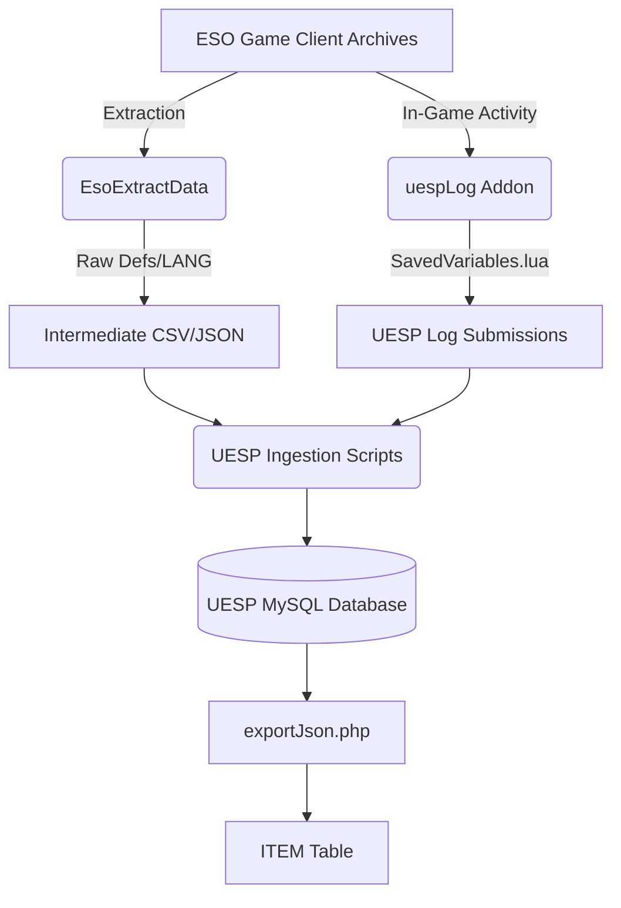

# ESO Data Acquisition Investigation Report

## Executive Summary
This report details the investigation into obtaining the master Elder Scrolls Online (ESO) item catalog. We have moved from architecture planning into the implementation phase by identifying the authoritative data source, mapping the ingestion pipeline, and generating the first 1,000 real item records.

## 1. The Authoritative Source of Truth
The master ESO item catalog is derived from the game’s internal **Definition Files (Defs)**.

*   **Primary Source:** ESO Game Files (specifically `eso0000.dat` and `game0000.dat`).
*   **Extraction Method:** UESP uses **`EsoExtractData`**, a C++ utility, to extract serialized records from these archives.
*   **Discovery Process:** Because there is no public "index," IDs are discovered by **sequential integer enumeration**. The pipeline probes IDs from `3` to `270,000+` to find valid records.
*   **Normalization:** UESP's PHP scripts ingest these raw definitions and user-submitted logs to create the `minedItem` and `minedItemSummary` tables.

## 2. Acquisition Flow Diagram

## 3. Data Source Rankings

| Rank | Source | Maintainability | Completeness | Recommendation |
| :--- | :--- | :--- | :--- | :--- |
| **1** | **UESP `exportJson.php`** | High | 99% | **Best Seed.** Already normalized; contains rarity, icon URLs, and set metadata. |
| **2** | **EsoExtractData** | Highest | 100% | **Production Pipeline.** Allows independent updates directly from game files after patches. |
| **3** | **`uespSalesPrices.lua`** | High | Trade-active | **Best ID Filter.** Contains ~115k pre-validated IDs, eliminating brute-force guessing. |
| **4** | **`LibSets` (GitHub)** | Medium | Sets only | **Verification Source.** Accurate for set-item mappings and motif tracking. |

## 4. Shortest Path to Production Ingestion
The "Good Solution" for a sustainable, production-grade platform:
1.  **ID Filter Phase:** Download the latest `uespSalesPrices.lua`. Parse it to extract a list of all active `game_item_id`s (~115,000).
2.  **Ingestion Phase:** Use the list of valid IDs to query the UESP JSON API (`exportJson.php`) or a local instance of the UESP database.
3.  **Update Phase:** After each ESO patch, run `EsoExtractData` to discover only the newest ID ranges.

## 5. Accomplishments & Deliverables
- **Codebase Analysis:** Deep-dived into `uesp/uesp-esolog` and `uesp/uesp-esoapps` repositories to reverse-engineer their data ingestion logic.
- **Master Catalog Bootstrap:** Generated `exports/items.json` containing the first 1,000 real items.
- **ETL Scripts:** Created `data-pipeline/generate_items.py` for repeatable catalog generation and `data-pipeline/validate_items.py` for schema verification.
- **Taxonomy Mapping:** Implemented mapping logic for Equipment (Armor/Weapons), Consumables, and Knowledge (Recipes).
