# ESO Trade Project: Database Schema Design (v2 - Scalable Architecture)

This document outlines the PostgreSQL database schema for the ESO Personalized Collection & Trading Platform. It is designed to scale to **all tradeable ESO items** and supports both account-wide and character-specific knowledge tracking.

## 1. Entity-Relationship Diagram (ERD)

```mermaid
erDiagram
    USER ||--o{ CHARACTER : owns
    USER ||--o{ KNOWLEDGE : "tracks (account/char)"
    USER ||--o{ USER_INVENTORY : has
    USER ||--o{ WATCHLIST : tracks
    USER ||--o{ TRADE_REQUEST : initiates
    USER ||--o{ ACTIVITY_LOG : generates

    CHARACTER ||--o{ KNOWLEDGE : "character-specific"
    
    ITEM ||--o{ KNOWLEDGE : "tracked in"
    ITEM ||--o{ GUILD_TRADER_LISTING : listed
    ITEM ||--o{ USER_INVENTORY : "stored as duplicate"
    ITEM ||--o{ WATCHLIST : "monitored in"
    ITEM ||--o| ITEM_PRICE : "current market"
    ITEM ||--o{ PRICE_HISTORY : "historical trends"
    ITEM ||--o{ ITEM_SOURCE_MAP : "sourced from"
    
    ITEM_SOURCE ||--o{ ITEM_SOURCE_MAP : "linked to"

    USER {
        uuid id PK
        string username
        string discord_id
        string email
        boolean is_anonymized
        timestamp created_at
    }

    CHARACTER {
        uuid id PK
        uuid user_id FK
        string name
        string class
        integer level
        boolean is_master_crafter
        timestamp last_sync_at
    }

    ITEM {
        uuid id PK
        integer game_item_id UK "ESO Internal Item ID"
        string name
        string item_type "Knowledge, Equipment, Material, etc."
        string category "Motif, Weapon, Crafting, etc."
        string subcategory "Chapter, Destruction Staff, Raw Material, etc."
        integer rarity
        string icon_url
        jsonb metadata "Trait, Set, Style, Difficulty, etc."
    }

    KNOWLEDGE {
        uuid id PK
        uuid user_id FK
        uuid character_id FK "NULL for account-wide knowledge"
        uuid item_id FK
        boolean is_known
        timestamp learned_at
    }

    ITEM_SOURCE {
        uuid id PK
        string name "Zone Name, DLC Name, Event Name"
        string source_type "Zone, DLC, Event, Vendor, Trial, Dungeon"
    }

    ITEM_SOURCE_MAP {
        uuid item_id FK
        uuid source_id FK
    }

    ITEM_PRICE {
        uuid id PK
        uuid item_id FK
        string server "NA, EU"
        bigint avg_price
        bigint min_price
        bigint max_price
        bigint suggested_price
        timestamp last_updated
    }

    GUILD_TRADER_LISTING {
        uuid id PK
        uuid item_id FK
        string server "NA, EU"
        bigint price
        integer quantity
        string guild_name
        string location
        timestamp expires_at
        timestamp discovered_at
    }

    USER_INVENTORY {
        uuid id PK
        uuid user_id FK
        uuid item_id FK
        integer quantity "Duplicate count"
    }

    WATCHLIST {
        uuid id PK
        uuid user_id FK
        uuid item_id FK
        bigint target_price
        boolean is_notified
    }

    TRADE_REQUEST {
        uuid id PK
        uuid requester_id FK
        uuid responder_id FK
        uuid item_offered_id FK
        uuid item_requested_id FK
        string status "Pending, Accepted, Rejected"
        timestamp created_at
    }

    PRICE_HISTORY {
        uuid id PK
        uuid item_id FK
        bigint price
        timestamp recorded_at
    }

    ACTIVITY_LOG {
        uuid id PK
        uuid user_id FK
        string type
        jsonb details
        timestamp created_at
    }
```



## 2. Table Definitions

### 2.1. Items & Metadata
- **`items`**: The backbone of the system.
    - `game_item_id`: First-class citizen identifier (ESO Internal ID). Used for all lookups and imports.
    - `item_type`, `category`, `subcategory`: Flexible taxonomy to support everything from motifs to raw ore and equipment.
    - `metadata (JSONB)`: Stores item-specific attributes like "Set Name", "Trait", "Crafting Style", or "Provisioning Rank".

### 2.2. Knowledge & Progress
- **`knowledge`**: A unified table for tracking what a user or character knows.
    - **Account-wide**: `character_id` is NULL.
    - **Character-specific**: `character_id` links to the specific character.
    - This model future-proofs against changes in how ESO handles progression (e.g., account-wide achievements vs. character-specific motifs).

### 2.3. Sourcing
- **`item_source`**: Defines origins like "Zone: Grahtwood", "Trial: Cloudrest", or "Event: Whitestrake's Mayhem".
- **`item_source_map`**: Many-to-many relationship allowing an item to be sourced from multiple locations/events.

### 2.4. Market Intelligence
- **`item_prices`**: Real-time aggregate market data per server (NA/EU).
- **`price_history`**: Time-series data for market analytics and trend forecasting.
- **`guild_trader_listings`**: Active listings for the "Personalized Shop" feature.

### 2.5. Personalization & Trading
- **`user_inventory`**: Tracks duplicates for the Trade Matcher.
- **`watchlists`**: User alerts for price drops.
- **`trade_requests`**: Facilitates WTT (Want To Trade) interactions.

## 3. Scalability & Logic

### Market Intelligence
The combination of `game_item_id` and the `metadata` JSONB column allows for sophisticated querying:
```sql
-- Find all Precise Inferno Staffs from the Mother's Sorrow set
SELECT * FROM items 
WHERE subcategory = 'Destruction Staff' 
AND metadata @> '{"set": "Mother''s Sorrow", "trait": "Precise"}';
```

### Personalized Recommendations
The schema supports finding the "best value" missing items by joining `knowledge`, `items`, and `item_prices`:
```sql
SELECT i.name, p.suggested_price 
FROM items i
JOIN item_prices p ON i.id = p.item_id
WHERE i.id NOT IN (
    SELECT item_id FROM knowledge 
    WHERE user_id = :user_id AND (character_id = :char_id OR character_id IS NULL)
)
ORDER BY p.suggested_price ASC;
```

### First-Class Identifiers
While `uuid` remains the Primary Key for internal database integrity, the `game_item_id` is uniquely indexed. All ingestion pipelines (TTC, Addon syncs) will use `game_item_id` for UPSERT operations.
